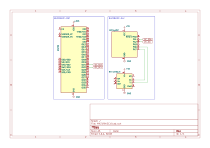

MHZ19XI2C
=====

このデモは、 MH-Z19シリーズのモジュールをI2Cデバイスとして動作させ、他のMCUからI2Cバス経由で操作する例を提示するものです。

I2Cバスを経由して、MH-Z19シリーズのモジュールから計測値を取得できるようにすることを目的としていますが、実装として作り込みは十分ではありません。

## ディレクトリ構成

- [MHZ19XI2C](./MHZ19XI2C/): 後述するI2Cコマンドおよびレジスタの定義を含むヘッダファイル[`MHZ19XI2C.hpp`](./MHZ19XI2C/MHZ19XI2C.hpp)を提供します。
- [MHZ19XI2C-SLV](./MHZ19XI2C-SLV/): MH-Z19シリーズのモジュールを、I2Cデバイスとして動作させるためのPlatformIOプロジェクトです。　このデモでは、MCUとして**ATtiny402**を使用しています。
- [MHZ19XI2C-MST](./MHZ19XI2C-MST/): MH-Z19シリーズのモジュールを、I2Cバス経由で操作し、計測値を取得するためのPlatformIOプロジェクトです。　このデモでは、MCUとして**ESP32**を使用しています。

## 配線図
このデモで使用している配線は次のとおりです。　一部周辺部品等は省略しています。

## I2Cアドレス
`0x19`を使用します。

[`MHZ19XI2C.hpp`](./MHZ19XI2C/MHZ19XI2C.hpp)を編集することで、任意のアドレスに変更することができます。

## I2Cコマンド構成
このデモでは、以下のI2Cコマンドを用いてモジュールの操作を行います。

- `0x00` `<ADDR>` (コマンド長: 2バイト)
  - `<ADDR>`で指定されるアドレスのレジスタ値を読み取ります。
- `0x01` `<ADDR>` `<VALUE>` (コマンド長: 2+nバイト)
  - `<ADDR>`で指定されるアドレスのレジスタ値として、`<VALUE>`指定される1バイト以上のバイト列を設定します。

## 仮想レジスタ構成
このデモでは、以下の仮想レジスタを構成します。　レジスタアドレス、及び値の意味は次のとおりです。

- `0x79`: セルフキャリブレーション設定 (1バイト)
  - `0x00`: オフ
  - `0x00`以外: オン
- `0x86`: 最新のCO2濃度計測値 (2バイト、16ビット符号なし整数、単位 [PPM])
  - 1バイト目:計測値の上位8ビット
  - 2バイト目:計測値の下位8ビット
- `0xF0`: CO2濃度計測値の取得間隔 (1バイト、単位 [秒])
  - `0x01`~`0xFF`: 1〜255秒
  - `0x00`: 取得を停止する
- `0xFE`: CO2濃度計測値取得時のエラーコード (1バイト)
  - `0x00`: 成功 (`MHZ19X_error_t::success`)
  - `0x00`以外: 失敗 (`MHZ19X_error_t`で定義される値と同じ値)
